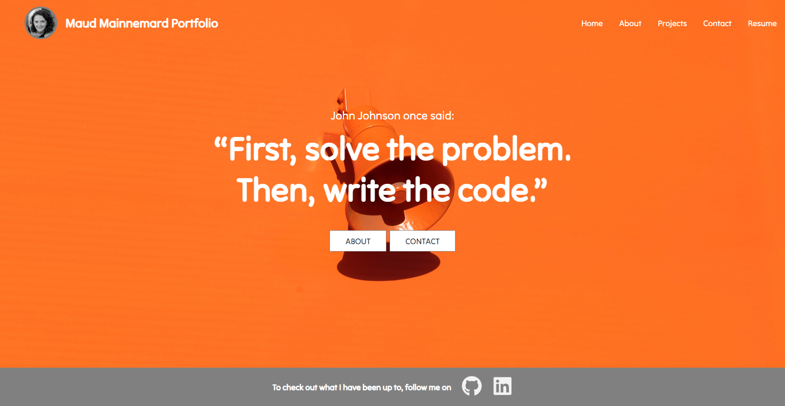

 
# React Portfolio

## 💻 Description

This challenge was about create a React portfolio.
 
With this project I have learn how to:

- create a React App
- use React components
- pass data between components using state and props
- use React Router
- CSS practice and responsivness

## 🧾 Table of Contents

- [Installation](#🔧-Installation)
- [Usage](#⏯️-usage)
- [License](#📜-license)
- [Credits](#credits)
- [Contribution](#🧑‍🤝‍🧑-contribution)
- [Questions](#💬-questions)
    
## 🔧 Installation

1. Clone this repository using the git clone command and the repo URL in your command line
2. Install NPM package "inquirer" `npm install`
3. Install the dependencies using `npm install` for :
- "react-dom"
- "react-icons"
- "react-router-dom"

## ⏯️ Usage
1. Open the [deployed link](https://maudmain.github.io/mm-react-portfolio/) 

2. Navigate to different pages and links using the navbar.
- Home 
Brand statement, buttons to About and Contact pages.

- About
Quick note and button to projects and contact pages.
- Projects
Project Gallery displaying tiles, title, text and links to deployed page and GitHub repo.

- Contact
Contact Form (only front end- not working) and email link (working)

- Resume 
PDF opens in a new tab
- Social links on all pages (in the footer)

## 🧑‍🤝‍🧑 Contribution

If you're interested in contributing, fork the repo, make your changes, and submit a pull request.

## Credits

- edX Bootcamp: for project brief and criterias, tutorial and ressources on React provided during this week's course.
- [Tech2 etc portfolio tutorial](https://www.youtube.com/watch?v=0h2b4ftbZcU) which offered a great portfolio layout and step by step instructions.
- Unsplash for jumbotron and Hero pictures
https://unsplash.com/photos/DIewyzpUbRc 
https://unsplash.com/photos/QRKJwE6yfJo

## 📜 License

Licensed under the MIT license.

     
## 💬 Questions

Feel free to contact us with suggestions for improvements, questions or concerns via [email](117314424+maudmain@users.noreply.github.com).  

And don't forget to check us up on [GitHub](github.com/maudmain)

  